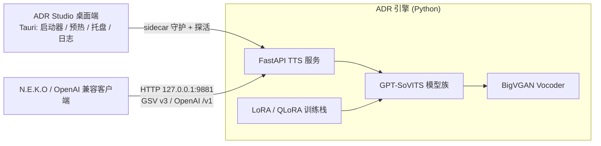

# ADR Studio — 本地语音克隆与合成工作台

[](LICENSE)

**ADR**（Audio Disentangled Reconstruction）是一个运行在**你自己电脑上**的语音克隆 / TTS 工作台：用几分钟参考音频完成声音克隆训练，并提供 GPT-SoVITS 兼容的流式合成服务。所有推理与训练均在本地完成，**你的语音与文本数据不会上传到任何服务器**。

## 特性

- **低资源训练** — LoRA / QLoRA 微调只训约 1% 参数，显存占用降低约 70%；梯度检查点 + 混合精度，消费级显卡（4-8GB VRAM）即可训练，CPU 也可推理
- **流式 TTS 服务** — 实现 GPT-SoVITS api_v3 双工流式协议（`/api/v3/voices` + `/api/v3/tts/stream-input`），流式返回 WAV 音频块
- **OpenAI 兼容接口** — `POST /v1/audio/speech`、`GET /v1/models`，任何 OpenAI TTS 兼容客户端可直接接入
- **N.E.K.O 零配置对接** — provider 选 GPT-SoVITS、地址保持默认 `http://127.0.0.1:9881` 即可，音色下拉自动列出 ADR 声音档案
- **全离线桌面应用** — Tauri 桌面端内置便携 Python 运行时与全部依赖，安装即用；首次启动自动下载预训练底模（带进度提示），之后完全离线
- **数据处理管线** — 音频切片 / ASR 转写 / F0 提取 / 音素化一条龙（`adr process`）

## 安装

### 方式一：Windows 安装包（推荐）

1. 从 [123 云盘分享](https://1860775428.share.123pan.com/123pan/5KDqvd-oPPsv)（提取码 `ADRS`）下载 `ADR-Studio-1.0.0-x64-setup.exe`（约 2.2GB；安装包未经充分测试，如遇问题请提 [Issues](https://github.com/HMUG12/Audio-Disentangled-Reconstruction/issues)）
2. 双击安装，按向导阅读并接受许可协议（per-user 安装，无需管理员权限）
3. 首次启动会自动进行环境预热：下载预训练底模 pretrained_models.zip（约 4.35GB，界面实时显示进度）；完成后进入就绪状态，此后**完全离线**运行

安装内容：Python 便携运行时 + 全部依赖 + GPT-SoVITS 代码 + ADR 引擎，磁盘占用约 3.8GB（不含底模与声音档案数据）。

> 批量部署可使用静默安装：`ADR-Studio-1.0.0-x64-setup.exe /VERYSILENT /SUPPRESSMSGBOXES /NORESTART /DIR="安装目录"`

### 方式二：源码安装

环境要求：Windows 推荐，Python 3.10+；NVIDIA GPU 可选（CPU 可推理，训练建议 GPU）。

```powershell
# 1. 安装（M1 基础 + WebUI）
pip install -e .[m1]

# 训练加速（LoRA/QLoRA, 按需）
pip install -e .[m2]

# 2. 启动 TTS 服务（默认端口 9881, NEKO 直连）
$env:NUMBA_CACHE_DIR = "E:\adr_numba_cache"   # 任意可写目录, 避免 numba 缓存落只读路径
python -m adr.server

# 3. 或启动 legacy WebUI (Gradio, 7860)
adr webui          # 等价于双击 启动WebUI.bat
```

常用命令：

| 命令 | 说明 |
| --- | --- |
| `python -m adr.server` | 启动 GSV 兼容 TTS 服务（默认 127.0.0.1:9881，`-p` 改端口 / `-a` 改地址） |
| `adr process -i <音频文件或目录> -o ./output/processed` | 数据处理管线：切片 / 转写 / 音素化 |
| `adr train -d <数据目录> --lora --lora-rank 8` | LoRA 微调训练 |
| `adr clone --ref <wav> --text <文本>` | 单句克隆推理 |
| `adr model list / download / info` | 预训练模型管理 |
| `adr doctor [--fix]` | 环境 / 数据体检 |
| `adr webui` | legacy WebUI（功能冻结期） |

### API 一览

服务默认只监听 `127.0.0.1:9881`（仅本机可达，N.E.K.O 本机对接不受影响）。

| 接口 | 用途 |
| --- | --- |
| `POST /api/v3/tts/stream-input` | GPT-SoVITS api_v3 双工流式合成 |
| `GET /api/v3/voices` | 音色列表 |
| `POST /v1/audio/speech` | OpenAI 兼容 TTS |
| `GET /v1/models` | OpenAI 兼容模型列表（即音色档案） |
| `GET /api/adr/v1/health` | 健康检查（引擎阶段 / 就绪状态） |

需要局域网内其他设备调用时，**必须同时设置 API key**：

```powershell
$env:ADR_TTS_API_KEY = "<你的密钥>"     # 支持逗号分隔多个
python -m adr.server --addr 0.0.0.0
```

客户端凭据三选一：`Authorization: Bearer <key>` / `X-API-Key: <key>` 头 / `?api_key=<key>` 查询参数。监听 `0.0.0.0` 且未设置 key 时，局域网内任何设备均可**无鉴权**调用（启动横幅会打安全警告）。

## N.E.K.O 对接

1. 启动 ADR Studio 桌面端（或 `python -m adr.server`），确认横幅显示监听端口（默认 9881）
2. N.E.K.O 设置 → 语音合成 → provider 选 **GPT-SoVITS**，API 地址填 `http://127.0.0.1:9881`（也可使用 OpenAI provider 配合 `POST /v1/audio/speech`）
3. 刷新音色列表，ADR 声音档案会自动出现

注意：首次合成有模型冷启动（数十秒），之后为流式秒级响应。若桌面端提示 "9881 被占用"，说明端口被其他 GSV 服务占用，改用提示的端口即可。

## 技术架构



- **桌面端**（Rust + WebView）：启动器、预热流程（底模下载进度透传）、系统托盘常驻、服务守护与日志面板、关于页
- **引擎**（Python + FastAPI）：GSV 兼容流式 TTS、OpenAI 兼容接口、声音克隆训练、数据处理管线
- **数据与日志目录**：优先级为 `ADR_DATA_DIR` 环境变量 → `F:/ADR_data`（旧版遗留路径，存在即用）→ `%LOCALAPPDATA%\ADR\data`；服务日志位于 `<数据目录>\logs\server.log`

## FAQ

**Q：首次启动 / 预热很慢？**
A：首次启动需下载约 4.35GB 的预训练底模，取决于网速可能需要较长时间；界面会实时显示下载进度，完成后不再需要网络。

**Q：纯 CPU 机器能用吗？**
A：可以。推理支持纯 CPU 运行（速度较慢）；训练建议 NVIDIA GPU（4-8GB VRAM 即可）。

**Q：9881 端口被占用？**
A：说明已被其他 GPT-SoVITS 服务占用。用 `-p <端口>` 改端口启动源码版；桌面端会在提示中给出可用端口。

**Q：我的声音档案和数据存在哪里？**
A：见"技术架构"末条的数据目录优先级。安装包默认不含任何声音数据；升级 / 重装不会丢失已训练的声音档案。

**Q：与 GPT-SoVITS 是什么关系？**
A：ADR 的推理服务实现了 GPT-SoVITS api_v3 兼容协议并复用其模型体系与训练思路，让 N.E.K.O 等现成客户端无需改动即可接入；本项目对训练流程做了低资源化改造（LoRA / QLoRA 等）。感谢上游开源项目，详见下节第三方声明。

**Q：是否可以商用？**
A：本软件以 AGPL-3.0 授权，允许商用，但需遵守其条款（包括网络服务场景下向用户提供修改版源代码、保留版权声明等）；同时必须遵守协议页中的声音伦理条款（未经许可不得克隆他人声音）。

## 第三方组件

| 组件 | 许可证 |
| --- | --- |
| GPT-SoVITS | MIT |
| BigVGAN | MIT |
| python-build-standalone | MIT |
| Tauri | MIT / Apache-2.0 |

各组件遵循其原始许可证，相应许可声明随软件一同分发。

## License

本项目以 [GNU Affero General Public License v3.0（AGPL-3.0）](LICENSE)授权发布。Windows 安装包的许可协议页中另附本项目附加使用条款（声音伦理与使用边界等）。

## 文档

- [docs/](docs/) — 设计文档、里程碑计划、批次记录（m9-phase3-plan.md）
- [configs/](configs/) — 训练配置预设（default / vram_4gb / vram_8gb / ...）

## 联系方式

维护者：未知之致 · 联系QQ：3699672176
